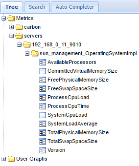

# What do we need?

- JMXtrans: provided by this image
- A backend such as Graphite: I recommend using [`nickstenning/graphite`](https://github.com/nickstenning/docker-graphite).

# How to build the image

```
$ git clone https://github.com/chtefi/jmxtrans-docker
$ cd jmxtrans-docker
$ docker build -t chtefi/jmxtrans:latest .
```

We can see our new image:

```
$ docker images chtefi/jmxtrans
REPOSITORY          TAG                 IMAGE ID            CREATED             SIZE
chtefi/jmxtrans     latest              c17b9838505c        5 hours ago         178 MB
```

The image provides 2 volumes (and does not expose any port):

- `/opt/jmxtrans/conf`
- `/opt/jmxtrans/logs` (optional)

# Start the containers

It seems JMXTrans has trouble if Graphite is not available at first (no retry logic?), so we'll start with Graphite.

## Start Graphite + Carbon.

This image exposes 4 ports but only 2 are interesting for us: 80 for the interface, and 2003 to send our metrics.
```
$ docker run -p 8080:80 -p 2003:2003 -d nickstenning/graphite
```

If we connect to http://localhost:8080/, we can see the Graphite UI without metrics, a few seconds later, some `carbon` metrics will appears (automatic).

Graphite provides the visual dashboards and Carbon provides the storage piece (port 2003).

## Start our JMXTrans image.

- We need to provide some conf by mounting the volumne `/opt/jmxtrans/conf`.
- We can also mount the volume `/opt/jmxtrans/log` to get the logs (optional).

There is a default configuration provided in the repo (`jmxtrans_conf`) but it won't probably fit your case: it is listening to `192.168.0.11:9010` to grab JMX data: you probably need to change that to your IP:port.

To get some generic JMX data, we can run a Java program with these options:

```
-Dcom.sun.management.jmxremote.port=9010 \
-Dcom.sun.management.jmxremote.authenticate=false \
-Dcom.sun.management.jmxremote.ssl=false
```

Note that JMXTrans will pull data from JMX every 10s (configured in the image command itself).

```
$ ls jmxtrans_conf
jmxtrans.conf
$ docker run -d --name jmxtrans -v c:/tmp/jmxtrans-docker/jmxtrans_log:/opt/jmxtrans/log \
                                -v c:/tmp/jmxtrans-docker/jmxtrans_conf:/opt/jmxtrans/conf \
                                chtefi/jmxtrans
```

If the configuration is all right (we can know by looking at the logs if we mount the volume), we can now look at Graphite.



# About JMXTrans configuration

You'll notice I've added `"flushStrategy": "always"` to the output writer because while testing, my metrics were never flushed, thus Graphite was always empty. In production, that should not be necessary.

